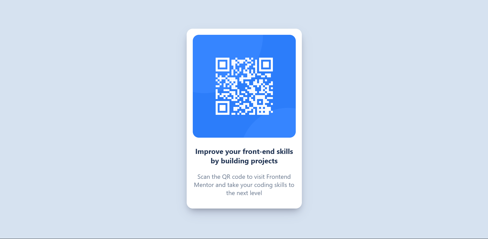

# Frontend Mentor - QR code component solution

This is a solution to the [QR code component challenge on Frontend Mentor](https://www.frontendmentor.io/challenges/qr-code-component-iux_sIO_H). 

### Screenshot

### Links

- Live Site URL: [Live Site](https://glistening-cobbler-cb84df.netlify.app)

### Built with

- Semantic HTML5 markup
- CSS custom properties

## Author

- Frontend Mentor - [@Ashim-Raj12](https://www.frontendmentor.io/profile/Ashim-Raj12)
